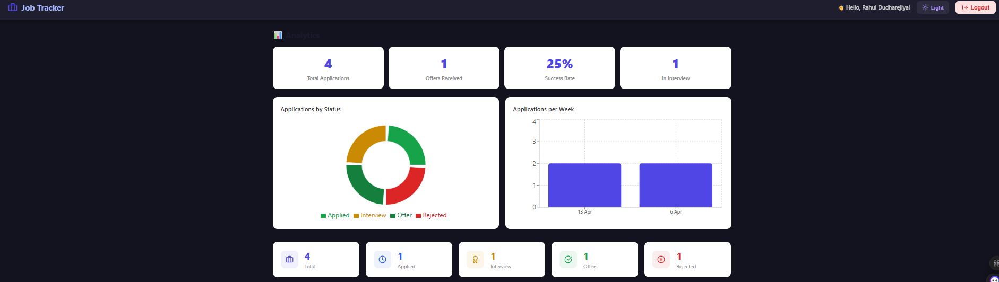
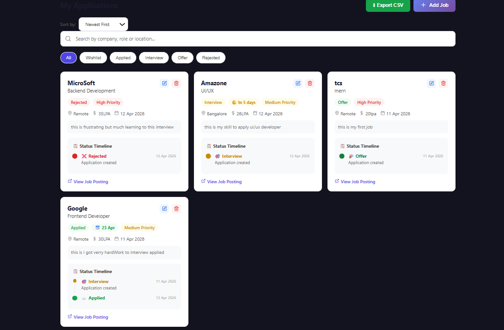

# 🚀 Job Tracker — MERN Stack Application



A full-stack job application tracking system built with the MERN stack. Track your job applications, monitor interview dates, visualize progress with charts, and manage your entire job search in one place!

## 🌐 Live Demo

🔗 **[Click Here to View Live App](https://job-tracker-ten-mauve.vercel.app)**

---

## ✨ Features

| Feature | Description |
|---------|-------------|
| 🔐 Authentication | Secure JWT-based login & register |
| ➕ Job Management | Add, Edit, Delete job applications |
| 🔍 Search & Sort | Filter jobs by company, role, location |
| 📊 Analytics Dashboard | Pie chart & bar chart visualizations |
| 📅 Interview Date Tracker | Never miss an interview! |
| 📋 Status Timeline | Track your journey for each job |
| ⬇️ Export to CSV | Download all jobs as Excel file |
| 🌙 Dark Mode | Easy on the eyes! |

---

## 📸 Screenshots

### 📊 Analytics Dashboard


### 💼 Job Applications


---

## 🛠️ Tech Stack

### Frontend
| Technology | Purpose |
|-----------|---------|
| React.js | UI Framework |
| React Router | Page Navigation |
| Context API | Global State Management |
| Axios | API Calls |
| Recharts | Data Visualization |
| Lucide React | Icons |
| React Hot Toast | Notifications |

### Backend
| Technology | Purpose |
|-----------|---------|
| Node.js | Runtime Environment |
| Express.js | Web Framework |
| MongoDB | Database |
| Mongoose | ODM |
| JWT | Authentication |
| Bcrypt | Password Hashing |

---

## 📁 Project Structure

job-tracker/
├── backend/
│   ├── config/
│   │   └── db.js
│   ├── controllers/
│   │   ├── authController.js
│   │   └── jobController.js
│   ├── middleware/
│   │   └── auth.js
│   ├── models/
│   │   ├── User.js
│   │   └── Job.js
│   ├── routes/
│   │   ├── auth.js
│   │   └── jobs.js
│   └── server.js
│
└── frontend/
└── src/
├── components/
│   ├── Navbar.jsx
│   ├── JobCard.jsx
│   ├── AddJobModal.jsx
│   ├── EditJobModal.jsx
│   ├── Analytics.jsx
│   ├── StatusTimeline.jsx
│   └── Loader.jsx
├── context/
│   └── AuthContext.jsx
├── pages/
│   ├── Login.jsx
│   ├── Register.jsx
│   └── Dashboard.jsx
└── utils/
├── api.js
└── interviewHelper.js

---

## 🚀 Run Locally

### Prerequisites
- Node.js installed
- MongoDB Atlas account

### 1. Clone the repository
```bash
git clone https://github.com/rahul-dudhrejiya/job-tracker.git
cd job-tracker
```

### 2. Setup Backend
```bash
cd backend
npm install
```

Create `.env` file inside backend folder:

```bash
npm run dev
```

### 3. Setup Frontend
```bash
cd frontend
npm install
npm run dev
```

### 4. Open Browser
Frontend → http://localhost:5173
Backend  → http://localhost:5000

---

## 🔗 API Endpoints

### Auth Routes
| Method | Endpoint | Description |
|--------|----------|-------------|
| POST | /api/auth/register | Register new user |
| POST | /api/auth/login | Login user |
| GET | /api/auth/me | Get current user |

### Job Routes (Protected)
| Method | Endpoint | Description |
|--------|----------|-------------|
| GET | /api/jobs | Get all jobs |
| POST | /api/jobs | Create new job |
| PUT | /api/jobs/:id | Update job |
| DELETE | /api/jobs/:id | Delete job |

---

## 👨‍💻 Developer

**Rahul Dudharejiya**

[](https://github.com/rahul-dudhrejiya)
[](https://linkedin.com/in/rahul-dudhrejiya)

---

## 📄 License

MIT License © 2026 Rahul Dudharejiya